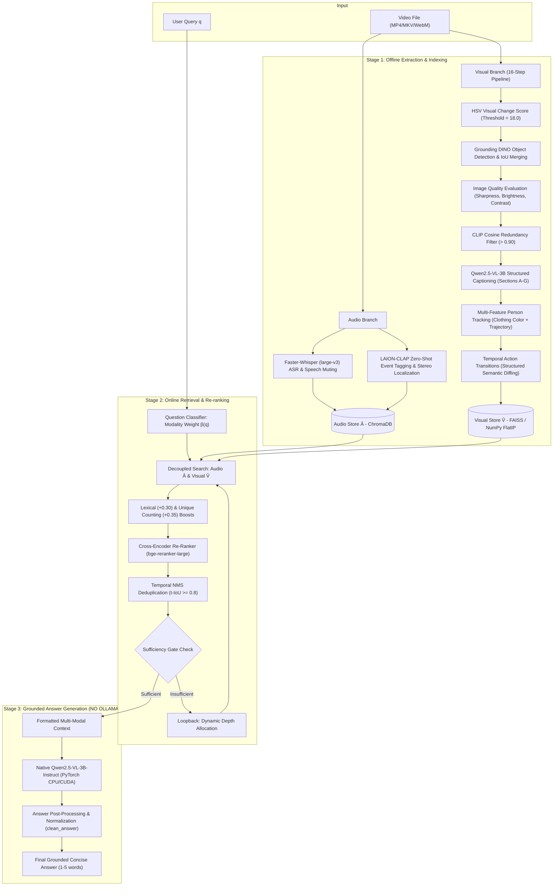

# EchoVision: Decoupled Audio-Visual RAG Pipeline for Video Question Answering

EchoVision is an advanced, multi-modal **Retrieval-Augmented Generation (RAG)** framework designed for **Video Question Answering (Video QA)**. It completely decouples audio processing (speech transcription and acoustic sound event detection) from visual processing (scene detection, multi-metric image quality assessment, VLM captioning, temporal transition reasoning, and CLIP vector embeddings) to deliver accurate, hallucination-resistant, grounded answers using local LLMs.

---

## ⚡ Quick Start: Step-by-Step Setup & Execution

Follow these steps to set up and run EchoVision on your machine.

### Step 1: Install System Dependencies

#### 1. Python 3.10+
Ensure Python 3.10 or higher is installed:
```bash
python --version
```

#### 2. FFmpeg (Audio Extraction)
FFmpeg is automatically handled by the bundled `imageio-ffmpeg` package. If you prefer a system-level binary:
- **Windows**: Run in PowerShell or Command Prompt:
  ```cmd
  winget install FFmpeg
  ```
  *(Or download static binaries from [ffmpeg.org](https://ffmpeg.org/) and add `ffmpeg/bin` to system PATH)*
- **Linux (Ubuntu/Debian)**:
  ```bash
  sudo apt update && sudo apt install -y ffmpeg
  ```
- **macOS**:
  ```bash
  brew install ffmpeg
  ```

#### 3. Native Multimodal Model (Zero Ollama Requirement)
EchoVision uses **`Qwen2.5-VL-3B-Instruct`** natively in Python via PyTorch and Hugging Face Transformers.
- **No Ollama server is required.**
- Model weights are automatically cached locally on disk upon first run (or shared with `VisualExtractor`).
- Runs seamlessly on CPU (using optimized float32) or NVIDIA CUDA GPUs (using float16/bfloat16).

---

### Step 2: Environment Setup & Python Dependencies

Navigate to the project root directory and install the Python requirements:

```bash
# Optional: Create and activate a virtual environment
python -m venv venv

# On Windows:
venv\Scripts\activate
# On Linux/macOS:
source venv/bin/activate

# Install Python requirements
pip install -r requirements.txt
```

---

### Step 3: Prepare Your Dataset Directory Structure

Organize your video files and question JSON files inside a dataset folder (e.g. `dataset/`, `MusicAVQA/`, or `smoke_test/`):

```
EVL3/
├── dataset/
│   ├── videos/
│   │   ├── OFTkwnSh-sQ.mp4
│   │   ├── wE9sQbGdeAk.mp4
│   │   └── er5jUsRr4y0.mp4
│   └── json/
│       └── test_questions.json
```

#### Supported Input JSON Format
The parser supports multiple common schema formats (arrays, single objects, wrapped dicts) and flexible key aliases:
- **Video ID aliases**: `video_name`, `video_id`, `video`, `video_path`, `video_file`, `video_filename`, `filename`, `file_name`, `vid`, `movie`
- **Question aliases**: `question`, `q`, `query`, `question_text`, `text`, `prompt`
- **Ground Truth aliases**: `answer`, `ground_truth_answer`, `ground_truth`, `gt_answer`, `label`, `target`

Sample input format (`dataset/json/test_questions.json`):
```json
[
  {
    "id": 1,
    "category": "spatial",
    "video_name": "v_0q9yZPTBbus",
    "question_id": "v_0q9yZPTBbus_4",
    "question": "what is in front of the person in red clothes",
    "answer": "mirror"
  },
  {
    "id": 2,
    "category": "counting",
    "video_name": "v_0q9yZPTBbus",
    "question_id": "v_0q9yZPTBbus_7",
    "question": "how many people are there in the video",
    "answer": "2"
  }
]
```

---

### Step 4: Run the EchoVision Pipeline (Two-Step Workflow)

#### 1. Run `ingestion.py` for Stage 1 (Offline Feature Extraction & Isolated Vector Indexing):
```bash
python ingestion.py --dataset_dir dataset
```
*What happens:*
- Recursively scans `dataset/videos/`.
- **Audio Extraction**: Extracts 16 kHz Mono audio, segments with 3s window (1s overlap), detects speech (`Faster-Whisper large-v3`), zeroes out speech intervals to isolate background, classifies acoustic sound events (`LAION-CLAP`), and merges facts $\rightarrow$ saves to an isolated **ChromaDB** collection (`audio_collection`).
- **Visual Extraction (16-Step Pipeline)**: Detects scene cuts using consecutive frame HSV visual change score ($\ge 25.0$), runs open-vocabulary detection with **Grounding DINO** (`IDEA-Research/grounding-dino-tiny`), resolves detection overlaps (IoU > 0.45), filters frames with 4-metric image quality evaluation (sharpness $\ge 100$, brightness, contrast), removes redundancy using batched CLIP ViT cosine similarity ($> 0.90$), generates 7-section structured scene captions using **Qwen2.5-VL-3B-Instruct**, tracks persons across frames using clothing colors and spatial trajectory continuity (assigning persistent IDs `person_001`), computes video-level unique counts, and derives temporal action transitions using deterministic structured semantic diffing $\rightarrow$ saves to an isolated **FAISS** index (with resilient pure-NumPy fallback) and stores keyframe images in `data/keyframes/<video_id>/`.
- All indices are uniquely stored per video in `data/vector_stores/<video_stem>_<hash>/` preventing cross-contamination.

#### 2. Run `main.py` for Stage 2 (Retrieval & Re-ranking) and Stage 3 (Grounded Answer Generation):
```bash
python main.py --dataset_dir dataset --output_dir output
```
*What happens:*
- Discovers and loads pre-indexed Stage 1 vector stores from disk (0.00s overhead if already indexed).
- Parses `dataset/json/` questions and groups them by matched video.
- Dynamically estimates modality dependency ($\beta(q) \in [0, 1]$) and retrieves candidates from ChromaDB and FAISS with lexical (+0.30) and unique counting (+0.35) boosts.
- Applies cross-encoder re-ranking (`BAAI/bge-reranker-large`), Temporal NMS deduplication (overlap threshold 0.80), and sufficiency verification.
- **Stage 3 Grounded Generation**: Generates concise, grounded answers (1 to 5 words) using native **`Qwen2.5-VL-3B-Instruct`** in PyTorch (zero Ollama calls, singleton model caching) and applies benchmark-aligned answer normalization (`clean_answer`).
- Saves answers and video durations to `output/`.

#### Automatic Ingestion in One Command
You can run both Stage 1 and Stage 2/3 in a single command using `--auto-ingest`:
```bash
python main.py --dataset_dir dataset --output_dir output --auto-ingest
```

---

### Step 5: Check Your Generated Output

The resulting output file (e.g. `output/test_questions.json`) contains predictions along with the ground truth and exact video duration:

```json
[
  {
    "video_id": "v_0q9yZPTBbus",
    "question": "how many people are there in the video",
    "ground_truth_answer": "2",
    "predicted_answer": "2",
    "video_duration_sec": 119.792
  },
  {
    "video_id": "v_0q9yZPTBbus",
    "question": "what is in front of the person in red clothes",
    "ground_truth_answer": "mirror",
    "predicted_answer": "mirror",
    "video_duration_sec": 119.792
  }
]
```

---

## 🖥️ Detailed Execution Modes & Commands

### 1. Batch Dataset Processing (Default)
Runs processing over default `dataset/videos/` and `dataset/json/` folders and outputs to `output/`:
```bash
python main.py
```

### 2. Auto-Ingestion Mode
Processes questions and automatically executes Stage 1 ingestion for any video missing an existing vector store:
```bash
python main.py --auto-ingest
```

### 3. Running Pre-Packaged Datasets (e.g. `smoke_test` or `MusicAVQA`)
```bash
# Run smoke test dataset
python main.py --dataset_dir smoke_test --output_dir output_smoke --auto-ingest

# Run MusicAVQA dataset
python main.py --dataset_dir MusicAVQA --output_dir output_music --auto-ingest
```

### 4. Custom Input & Output Directories
Specify custom directories for videos, question JSONs, or output:
```bash
python main.py --videos_dir path/to/my_videos --json_dir path/to/my_jsons --output_dir path/to/my_results
```

### 5. Single Video & Interactive Prompt QA Mode
Test a single video file directly with a custom question prompt:
```bash
python main.py --video smoke_test/videos/v_0q9yZPTBbus.mp4 --question "what is in front of the person in red clothes"
```

### 6. Standalone Stage 1 Ingestion Only
Pre-extract features and build vector stores for videos without running QA inference:
```bash
python ingestion.py --dataset_dir dataset
# or specify custom video directory:
python ingestion.py --videos_dir dataset/videos
```

### 7. Force Re-Indexing
Force re-extraction and re-indexing of Stage 1 even if cached index files exist on disk:
```bash
python main.py --dataset_dir dataset --force-reindex
```

### 8. Interactive Jupyter Notebook
An end-to-end interactive Jupyter notebook is available:
- **`EchoVision_Pipeline.ipynb`**: Walk through configuration, offline extraction, decoupled vector search, re-ranking, and answer generation step-by-step with visual cell outputs.

---

## 🛠️ CLI Options Reference

| Argument | Type | Default | Description |
| :--- | :--- | :--- | :--- |
| `--dataset_dir` | `str` | `dataset` | Root path containing `videos/` and `json/` subdirectories. |
| `--videos_dir` | `str` | `None` | Custom path to video directory (overrides `dataset_dir/videos`). |
| `--json_dir` | `str` | `None` | Custom path to question JSON directory (overrides `dataset_dir/json`). |
| `--output_dir` | `str` | `output` | Directory where output JSON files are saved. |
| `--video` | `str` | `None` | Path to a single video file (triggers single-video QA mode). |
| `--question` | `str` | `None` | Prompt string for single-video QA mode. |
| `--force-reindex`| `flag`| `False` | Forces re-extraction and indexing of Stage 1 even if cached index exists. |
| `--auto-ingest` | `flag`| `False` | Automatically triggers Stage 1 ingestion for videos missing vector stores. |
| `--latency_file` | `str` | `output/ingestion_latency.json` | Path to save video ingestion latency report in JSON format. |

---

## 🏗️ System Architecture Flowchart



---

## 📁 Repository Directory Overview

```
.
├── main.py                     # Primary CLI entry point (Batch dataset QA & single video QA)
├── ingestion.py                # Dataset scanner & Stage 1 ingestion manager
├── config.py                   # Central configuration, hardware detection, & hyperparameters
├── EchoVision_Pipeline.ipynb   # Interactive step-by-step Jupyter Notebook
├── requirements.txt            # Python package dependencies
├── README.md                   # Project documentation & execution guide
│
├── stage1_offline/             # Stage 1: Feature extraction & vector storage
│   ├── audio_extractor.py      # Speech transcription (Whisper), speech muting, sound tagging (CLAP), & stereo source localization
│   ├── visual_extractor.py     # 16-Step pipeline: HSV change score, Grounding DINO, CLIP deduplication, Qwen-VL, clothing-based person tracking, & semantic diffing
│   ├── entity_tracker.py       # Legacy cross-frame entity tracker reference
│   └── vector_indexer.py       # Isolated ChromaDB and FAISS/NumPy index manager
│
├── stage2_online/              # Stage 2: Retrieval, reranking & sufficiency gate
│   ├── question_classifier.py  # Modality dependency estimator β(q)
│   ├── decoupled_retriever.py  # Independent vector search over audio/visual indices (lexical & counting boosts)
│   ├── deduplicator.py         # Temporal Non-Maximum Suppression (NMS)
│   ├── reranker.py             # Audio-boosted cross-encoder re-ranking & temporal agreement
│   └── sufficiency_gate.py     # Evidence sufficiency evaluator & loopback controller
│
├── stage3_generator/           # Stage 3: Context fusion & native VLM answer generation
│   └── generator.py            # Multimodal context builder, native Qwen2.5-VL inference, singleton weight caching, & cleaner
│
├── flowchart/                  # System Mermaid flowcharts (.mmd)
│   ├── full_pipeline.mmd       # Master end-to-end architecture flowchart
│   ├── visual_extractor.mmd    # 16-Step visual extraction & multi-feature person tracking flowchart
│   ├── audio_extractor.mmd     # Audio demux, Whisper ASR, speech interval removal, & CLAP SED flowchart
│   ├── vector_index.mmd        # Hash-isolated ChromaDB & FAISS/NumPy indexer flowchart
│   ├── stag2.mmd               # Online retrieval, dynamic depth, reranking & Stage 3 generation flowchart
│   └── stage3.mmd              # Grounded generation pipeline (HF Inference API / Local LLM, strict QA prompt, clean answer)

│
├── dataset/                    # Default dataset directory
│   ├── videos/                 # Video files (.mp4, .mkv, .webm, etc.)
│   └── json/                   # Question JSON annotations
│
├── MusicAVQA/                  # MusicAVQA benchmark dataset and question annotations
├── smoke_test/                 # Lightweight test sample for rapid validation
└── data/                       # Generated runtime data (auto-created)
    ├── keyframes/              # Extracted keyframe images & metadata.json per video
    └── vector_stores/          # Hash-isolated ChromaDB & FAISS indices per video
```

---

## 🔧 Hardware & Configuration Tuning (`config.py`)

All settings, thresholds, and model parameters can be tuned directly in `config.py`:

- **Experimental Models & Configuration**:
  - **LLM Generators**:
    - `qwen2.5-v1-72b-instruct` (**Default LLM**): High-capacity 72B reasoning model (runs via HF Serverless API or multi-GPU local).
    - `gemma-4-31b`: Google Gemma 2 27B/31B Instruct model.
    - `phi-3.5-vision-instruct`: Microsoft Phi-3.5 Vision multimodal model.
    - *(Custom Hugging Face repo IDs or local weights are also supported)*
  - **Visual Captioning Models**:
    - `Salesforce/blip-image-captioning-large` (**Default Captioning**): High-quality scene descriptions.
    - `Salesforce/blip-image-captioning-base`: Ultra-fast lightweight captioning.
    - `HuggingFaceTB/SmolVLM-256M-Instruct`: Compact 256M parameter multimodal VLM.
    - `wraps/moondream-caption`: Efficient edge vision model.
  - **Hugging Face Authentication Token (`HF_TOKEN`)**:
    - Load securely via environment variable:
      ```bash
      # Linux / macOS:
      export HF_TOKEN="hf_your_actual_token_here"

      # Windows PowerShell:
      $env:HF_TOKEN="hf_your_actual_token_here"
      ```
    - The token is **never hardcoded** and **never exposed** in logs, stdout, or saved files.
  - **Generation Backends (`GENERATOR_BACKEND`)**:
    - `auto` (Default): Uses Hugging Face Serverless Inference API for large models (e.g. 72B, 31B) to run without requiring 140GB VRAM, falling back to local PyTorch when feasible.
    - `api` / `serverless`: Always queries Hugging Face Inference API with `HF_TOKEN`.
    - `local`: Runs models locally via PyTorch / Transformers.
  - **Switching Models**:
    - Via Environment Variables:
      ```bash
      export LLM_MODEL="gemma-4-31b"
      export CAPTIONING_MODEL="HuggingFaceTB/SmolVLM-256M-Instruct"
      export GENERATOR_BACKEND="auto"
      ```
    - Via CLI Flags:
      ```bash
      python main.py --llm_model gemma-4-31b --captioning_model Salesforce/blip-image-captioning-large --llm_backend auto
      ```
    - Or directly edit `GENERATOR_MODEL` and `CAPTIONING_MODEL` in `config.py`.
- **Model Identifiers**:
  - `GENERATOR_MODEL`: `"qwen2.5-v1-72b-instruct"` (Default)
  - `CAPTIONING_MODEL`: `"Salesforce/blip-image-captioning-large"` (Default)
  - `WHISPER_MODEL`: `"large-v3"` (Runs in `float16` on CUDA, `int8` on CPU)
  - `CLAP_MODEL`: `"laion/clap-htsat-unfused"`
  - `CLIP_MODEL`: `"openai/clip-vit-base-patch32"`
  - `MODALITY_ESTIMATOR_MODEL`: `"all-MiniLM-L6-v2"`
  - `RERANKER_MODEL`: `"BAAI/bge-reranker-large"`
  - `GROUNDING_DINO_MODEL`: `"IDEA-Research/grounding-dino-tiny"`
  - `GENERATOR_MAX_NEW_TOKENS`: `32`
  - `SCENE_THRESHOLD`: `18.0` (Consecutive-frame HSV visual change threshold)
- **Retrieval & Reranking Hyperparameters**:
  - `KA_DEFAULT`: `5` (Default audio top-$k$ depth)
  - `KV_DEFAULT`: `10` (Default visual top-$k$ depth)
  - `SIMILARITY_THRESHOLD`: `0.90` (CLIP cosine similarity threshold for keyframe redundancy)
  - `NMS_OVERLAP_THRESHOLD`: `0.8` (Temporal IoU threshold for pruning redundant evidence)
  - `MODALITY_THRESHOLD`: `0.6` (Threshold above which a question is classified as audio-heavy)
  - `AUDIO_BONUS`: `1.0` (Weight multiplier added to candidate score when $\beta(q)$ is high)
  - `TEMPORAL_AGREEMENT_BONUS`: `0.5` (Bonus awarded to evidence sharing temporal windows)
- **Visual Quality & Keyframe Settings**:
  - `BLUR_THRESHOLD`: `100.0` (Laplacian variance threshold for sharpness)
  - `DARK_THRESHOLD`: `15.0` (Mean pixel brightness threshold)
  - `BRIGHTNESS_MAX_THRESHOLD`: `240.0` (Overexposure threshold)
  - `LOW_CONTRAST_THRESHOLD`: `20.0` (Pixel standard deviation threshold)

---

## ❓ Troubleshooting & FAQs

#### Q1: "Do I need to install or start Ollama?"
- **No.** The pipeline runs 100% locally in Python using native PyTorch/Transformers with `Qwen2.5-VL-3B-Instruct`. Ollama is completely bypassed and not required.
- The `Generator` class automatically caches model weights (`_shared_model`) so that weights are not duplicated in memory across questions or pipeline stages.

#### Q2: "FAISS DLL load blocked by Windows Application Control"
- The `VectorIndexer` includes an automatic pure-NumPy vectorized fallback (`NumpyIndexFlatIP`). If Windows security policy or AppLocker blocks `_swigfaiss.pyd`, the system automatically routes index operations through NumPy without failing.

#### Q2: "Working FFmpeg executable not found"
- The pipeline uses `imageio-ffmpeg` as an automatic fallback. If a custom system FFmpeg is preferred, ensure `ffmpeg` is accessible in your system `PATH` (run `ffmpeg -version` to verify).

#### Q3: "Question could not be matched to any video"
- EchoVision features an intelligent prefix-stripping matching engine (handles prefixes like `v_`, `video_`, file extensions, and casing).
- Ensure the `video_id` or `video_name` in your question JSON corresponds to the video file name in `dataset/videos/`.

#### Q4: "CUDA Out of Memory during Stage 1 Extraction"
- Stage 1 extractors automatically clear GPU caches between batches.
- You can reduce `CLIP_BATCH_SIZE` or `AUDIO_BATCH_SIZE` in `config.py` if running on lower VRAM GPUs.

---

## ☁️ Google Colab (T4 GPU) Online Framework Execution

EchoVision includes a ready-to-run Jupyter Notebook configured for Google Colab's **NVIDIA Tesla T4 GPU (15 GB VRAM)**: [`EchoVision_Online_T4_Colab.ipynb`](EchoVision_Online_T4_Colab.ipynb).

### What the Colab Notebook Provides:
1. **Automated T4 GPU Verification**: Checks CUDA availability, T4 hardware properties, and configures FP16 precision.
2. **GitHub Deployment Form**: Clones or pulls your deployed GitHub repository into the Colab environment.
3. **Stage 1 Vector Store Sync**: Easily mount Google Drive (`/content/drive/MyDrive/...`) to sync pre-computed vector stores or run Stage 1 ingestion on sample videos.
4. **Stage 2 & 3 Batch QA Evaluation**: Runs `python main.py` across full benchmark datasets with one click.
5. **Interactive Real-Time QA API**: Pre-loads models in memory to ask ad-hoc questions on any video directly from Python cells.
6. **Live Interactive Gradio Web UI**: Launches an interactive web app with public URL directly inside Colab.
7. **Evaluation & Result Export**: Displays predictions vs. ground truth in Pandas DataFrames and computes benchmark accuracy.

---

## 📄 License

This project is licensed under the MIT License.

